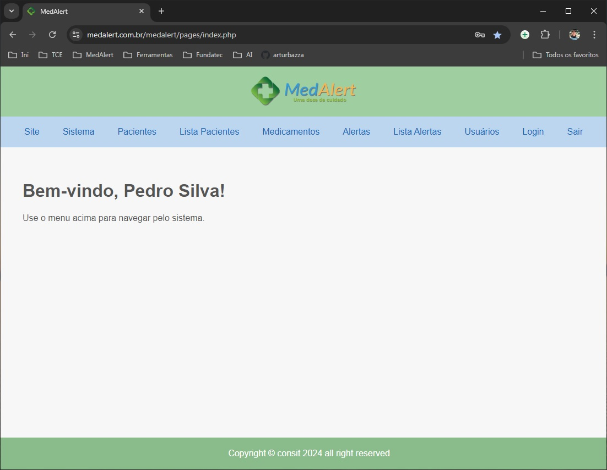
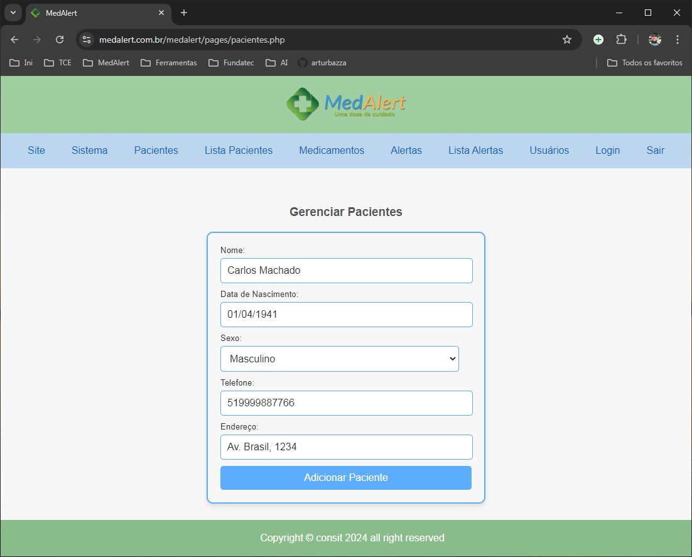
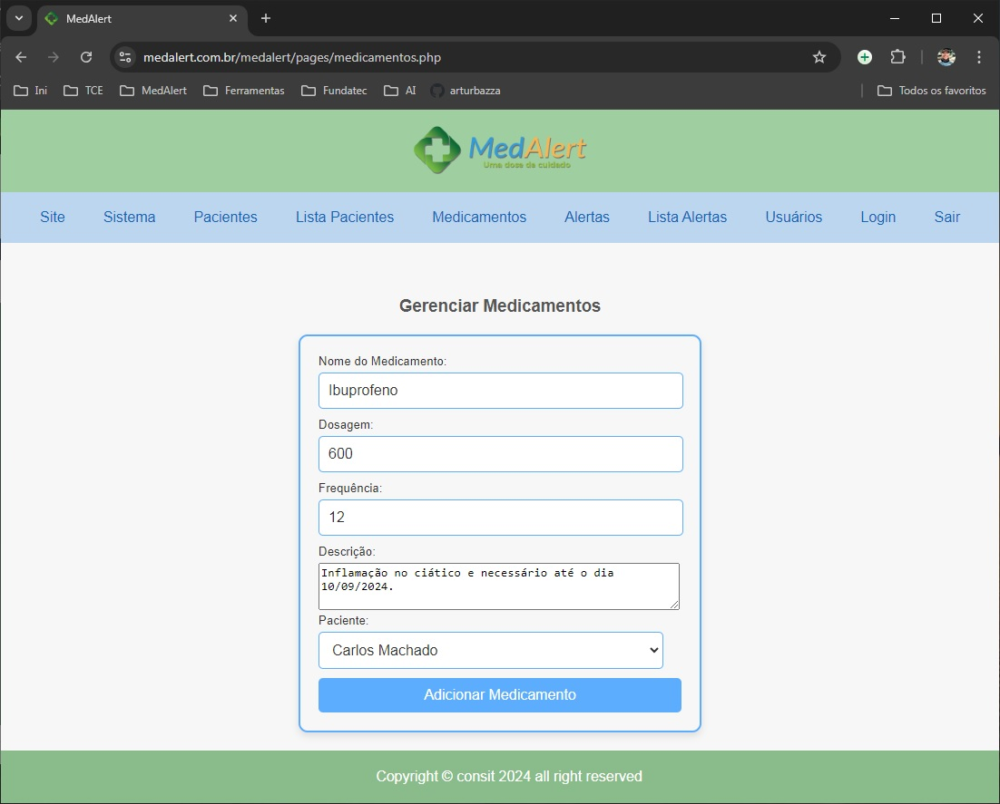
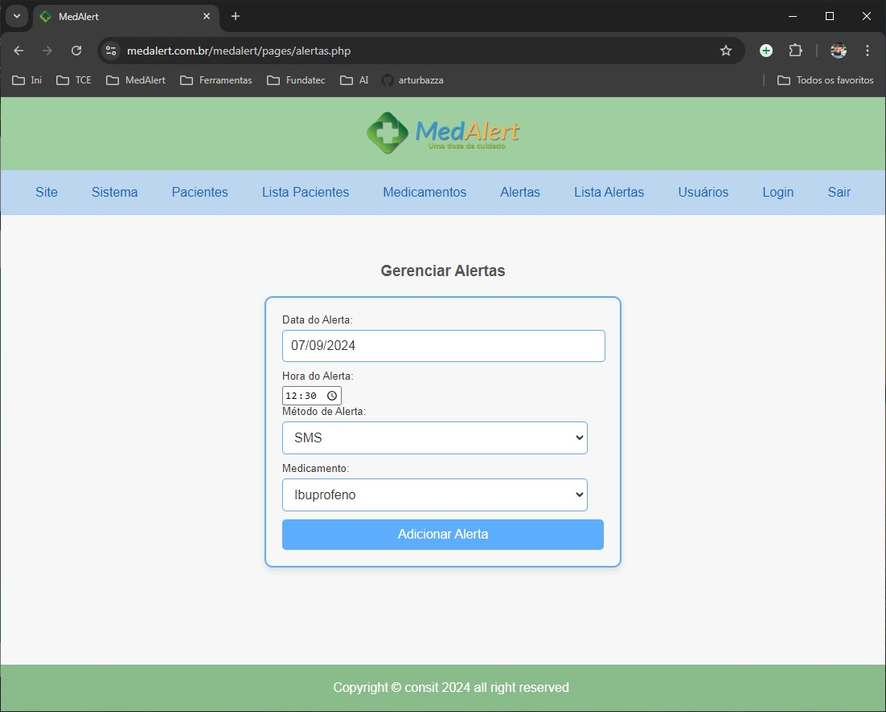
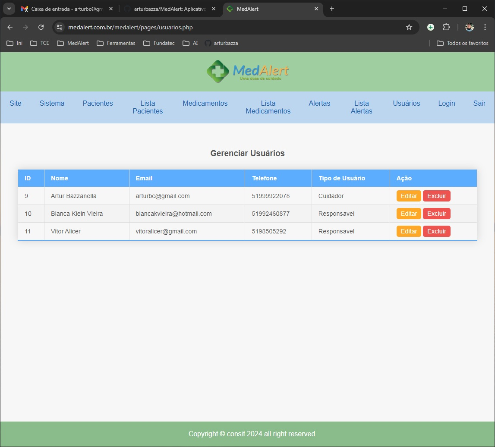

## Aplicação MedAlert v0.1-beta

App MedAlert para projeto de TCC para Técnico em Informática.

### O que é?
#### Gestão de Medicamentos

Aplicativo Web com notificações sonoras e visuais para auxiliar na administração de medicamentos a idosos; onde enfermeiros, cuidadores e responsáveis podem monitorar remotamente o cumprimento das tarefas, minimizando riscos e promovendo um acompanhamento mais eficiente, garantindo que os idosos tomem seus medicamentos nos horários corretos.

### Créditos

<p align="left">Artur Bazzanella<br>Porto Alegre - RS - Brasil<br>Formando para Técnico em Informática<br><a href="https://www.fonzie.com.br" target="_blank">www.fonzie.com.br</a><br><a href="mailto:artur@fonzie.com.br">artur@fonzie.com.br</a></p>

### Links

<p align="left">
- Site: <a href="https://www.medalert.com.br" target="_blank">www.medalert.com.br</a><br>
- Sistema: <a href="https://medalert.com.br/medalert/" target="_blank">medalert.com.br/medalert/</a>

### Tecnologias usadas

### HTML 5 + CSS 3 + JavaScript + PHP 8 + MySql 8

<div>
  
  
    
  
  
    
  
  
  
  
</div>
<br><br>

# Tutorial de Instalação

### 1. Clonando o Repositório

Para começar, faça o clone do repositório MedAlert:

```bash
git clone https://github.com/seu-usuario/MedAlert.git
```

Acesse o diretório:
```
cd MedAlert
```

### 2. Instalando o XAMPP

#### Windows:

1. Baixe o XAMPP no site oficial [XAMPP](https://www.apachefriends.org/download.html).
2. Durante a instalação, certifique-se de selecionar Apache e MySQL.
3. Após a instalação, inicie o Apache e o MySQL através do XAMPP Control Panel.

#### Linux:

1. Instale o XAMPP baixando o pacote no site oficial e siga as instruções para instalação no Linux.
   ```bash
   sudo ./xampp-linux-x64-installer.run
   ```
2. Inicie os serviços Apache e MySQL:
   ```bash
   sudo /opt/lampp/lampp start
   ```

### 3. Configuração do Banco de Dados

1. Acesse o PHPMyAdmin, disponível na URL `http://localhost/phpmyadmin`.
2. Crie um banco de dados chamado `medalert` usando o seguinte comando SQL:

```sql
CREATE DATABASE medalert;
```

3. Selecione o banco de dados recém-criado e, em seguida, crie as seguintes tabelas utilizando os comandos SQL fornecidos:

#### Tabela `usuarios`
```sql
CREATE TABLE usuarios (
    id_usuario INT AUTO_INCREMENT PRIMARY KEY,
    nome VARCHAR(100) NOT NULL,
    email VARCHAR(100) UNIQUE NOT NULL,
    senha VARCHAR(255) NOT NULL,
    telefone VARCHAR(15),
    tipo_usuario ENUM('cuidador', 'enfermeiro', 'medico', 'responsavel') NOT NULL,
    data_criacao TIMESTAMP DEFAULT CURRENT_TIMESTAMP
);
```

#### Tabela `pacientes`
```sql
CREATE TABLE pacientes (
    id_paciente INT AUTO_INCREMENT PRIMARY KEY,
    nome VARCHAR(100) NOT NULL,
    data_nascimento DATE NOT NULL,
    sexo ENUM('M', 'F', 'O') NOT NULL,
    telefone VARCHAR(15),
    endereco VARCHAR(255),
    id_usuario INT,
    data_criacao TIMESTAMP DEFAULT CURRENT_TIMESTAMP,
    FOREIGN KEY (id_usuario) REFERENCES usuarios(id_usuario) ON DELETE CASCADE
);
```

#### Tabela `medicamentos`
```sql
CREATE TABLE medicamentos (
    id_medicamento INT AUTO_INCREMENT PRIMARY KEY,
    nome_medicamento VARCHAR(100) NOT NULL,
    dosagem VARCHAR(50) NOT NULL,
    frequencia VARCHAR(50) NOT NULL,
    descricao TEXT,
    id_paciente INT,
    data_criacao TIMESTAMP DEFAULT CURRENT_TIMESTAMP,
    FOREIGN KEY (id_paciente) REFERENCES pacientes(id_paciente) ON DELETE CASCADE
);
```

#### Tabela `alertas`
```sql
CREATE TABLE alertas (
    id_alerta INT AUTO_INCREMENT PRIMARY KEY,
    data_hora_alerta DATETIME NOT NULL,
    status_alerta ENUM('pendente', 'confirmado', 'ignorado') NOT NULL,
    metodo_alerta ENUM('email', 'sms', 'app') NOT NULL,
    data_confirmacao DATETIME,
    id_medicamento INT,
    FOREIGN KEY (id_medicamento) REFERENCES medicamentos(id_medicamento) ON DELETE CASCADE
);
```

### 4. Configurando o Cron para Enviar Alertas

1. No servidor Linux, edite o Crontab:
   ```bash
   crontab -e
   ```
2. Adicione a seguinte linha para executar o script de envio de alertas a cada hora:
   ```bash
   0 * * * * /usr/bin/php /caminho/para/sua/aplicacao/MedAlert/send_alerts.php
   ```

3. Esse script irá buscar os dados do banco de dados e enviar notificações por email e SMS para os usuários.

<br><br>

# Prints Screems:
#### Tela Inicial

#### Tela Cadastro Paciente

#### Tela Cadastro Medicamentos

#### Tela Alertas

#### Tela Lista Usuários

