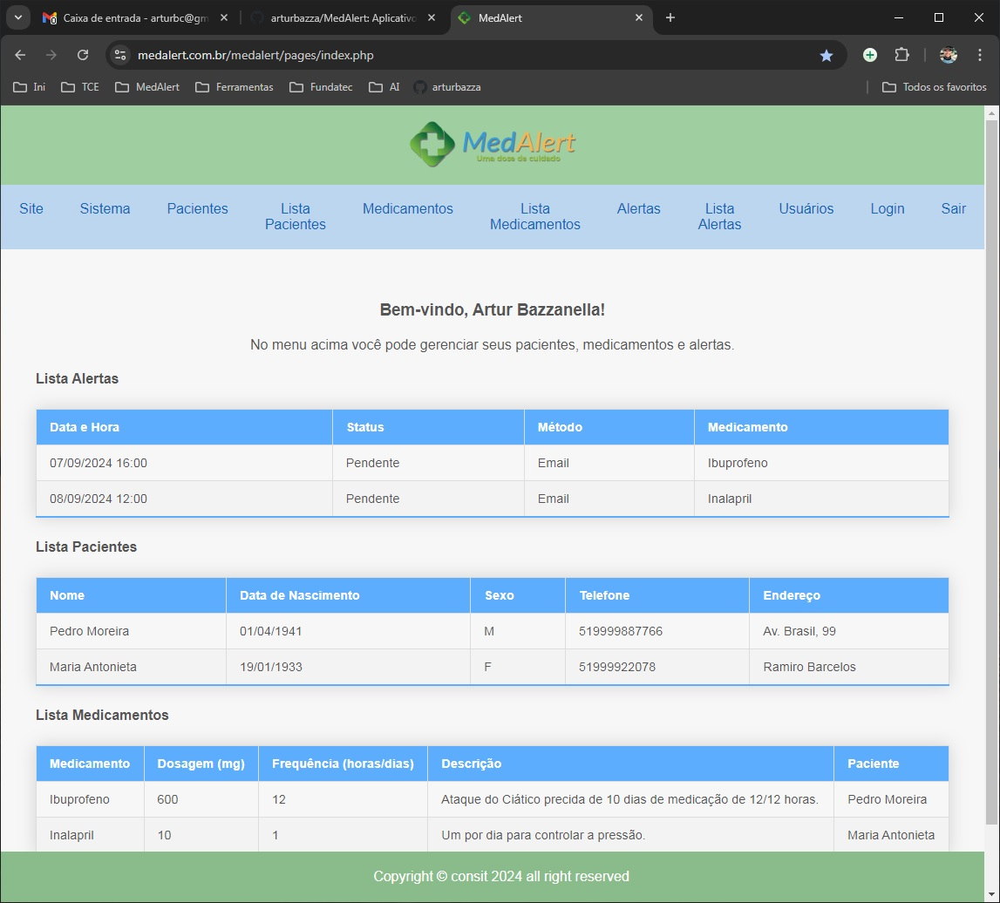

## Aplicação MedAlert

### PHP + MySql + HTML5 + Bootstrap 4

App MedAlert para projeto de TCC para Técnico em Informática

### Créditos

Artur Bazzanella Porto Alegre - RS - Brasil Formando para Técnico em Informática <a href="https://www.fonzie.com.br">www.fonzie.com.br</a> <a href="mailto:artur@fonzie.com.br">artur@fonzie.com.br</a>

### Tecnologias usadas

###

  
  
  
  
  
  
  
  

### Prints Screems:
#### Tela Inicial

#### Tela Cadastro Paciente

#### Tela Cadastro Medicamentos

#### Tela Alertas

#### Tela Lista Usuários

